# Sơ đồ Tuần tự: Quy trình Bán hàng Tổng quát

## Mô tả
Sơ đồ này mô tả quy trình bán hàng tổng quát từ khi nhân viên chọn chức năng bán hàng, tìm kiếm và chọn sản phẩm, đến việc chuẩn bị thông tin khách hàng trước khi thực hiện các nghiệp vụ cụ thể (bán nhanh hoặc gửi hàng).

## Actors
- **Nhân viên bán hàng** (Sales Staff)
- **Hệ thống bán hàng** (Sales System)
- **Cơ sở dữ liệu** (Database)
- **Hệ thống tồn kho** (Inventory System)

## Sequence Diagram (PlantUML)

```plantuml
@startuml General_Sales_Process_Sequence_Diagram
!theme aws-orange
title Sơ đồ Tuần tự: Quy trình Bán hàng Tổng quát

actor "Nhân viên\nBán hàng" as Staff
participant "Dashboard\nQuản lý" as Dashboard
participant "Giao diện\nTạo đơn hàng" as UI
participant "Sales System" as System
participant "Inventory\nSystem" as Inventory
database "Database" as DB

== Khởi động Quy trình Bán hàng ==
Staff -> Dashboard: Đăng nhập hệ thống
Dashboard -> System: Xác thực người dùng
System -> DB: Kiểm tra thông tin đăng nhập
DB --> System: Xác nhận user hợp lệ
System --> Dashboard: Hiển thị dashboard chính

Staff -> Dashboard: Chọn "Quản lý bán hàng"
Dashboard -> UI: Điều hướng đến /dashboard/sales/create
UI -> System: Khởi tạo phiên bán hàng mới
System -> System: resetCurrentInvoice() - Tạo hóa đơn trống

== Tải Danh sách Sản phẩm Mặc định ==
System -> DB: fetchDefaultProducts() - Lấy 5 sản phẩm đầu tiên
DB --> System: Trả về danh sách sản phẩm mặc định
System --> UI: Hiển thị sản phẩm trên giao diện

== Tìm kiếm và Chọn Sản phẩm ==
Staff -> UI: Nhập từ khóa tìm kiếm (searchTerm)
UI -> System: handleSearchProducts(searchTerm)
System -> DB: SELECT * FROM products WHERE name LIKE '%searchTerm%'
DB --> System: Trả về kết quả tìm kiếm
System --> UI: Cập nhật danh sách sản phẩm

Staff -> UI: Chọn sản phẩm từ danh sách
UI -> System: selectProduct(productId)
System -> DB: fetchProductDetails(productId)
DB --> System: Trả về thông tin chi tiết sản phẩm
System --> UI: Hiển thị thông tin sản phẩm đã chọn

Staff -> UI: Nhập số lượng mong muốn
UI -> System: setProductQuantity(productId, quantity)
System -> Inventory: checkStockAvailability(productId, quantity)

note right of Inventory
  Kiểm tra tồn kho:
  - Xác minh sản phẩm có sẵn
  - So sánh quantity yêu cầu vs stock hiện tại
  - Trả về trạng thái đủ/không đủ hàng
end note

alt Đủ hàng trong kho
    Inventory --> System: stockAvailable = true
    System -> System: addProductToInvoice(product, quantity)
    System -> System: calculateTotals() - Tính tổng tiền
    System --> UI: Cập nhật giỏ hàng và tổng tiền
else Không đủ hàng
    Inventory --> System: stockAvailable = false
    System --> UI: Hiển thị thông báo "Không đủ hàng trong kho"
    UI --> Staff: Yêu cầu điều chỉnh số lượng
end

== Chuẩn bị Thông tin Khách hàng ==
alt Bán hàng cho khách hàng có sẵn
    Staff -> UI: Tìm kiếm khách hàng
    UI -> System: searchCustomer(searchTerm)
    System -> DB: SELECT * FROM customers WHERE name LIKE '%searchTerm%'
    DB --> System: Trả về danh sách khách hàng
    System --> UI: Hiển thị danh sách khách hàng
    
    Staff -> UI: Chọn khách hàng
    UI -> System: selectCustomer(customerId)
    System -> DB: fetchCustomerDetails(customerId)
    DB --> System: Trả về thông tin chi tiết khách hàng
    System --> UI: Hiển thị thông tin khách hàng đã chọn
else Bán hàng cho khách lẻ
    Staff -> UI: Chọn "Khách lẻ"
    UI -> System: setCustomerType("walk-in")
    System --> UI: Đánh dấu khách hàng là khách lẻ
end

== Xác nhận Chuẩn bị ==
System -> System: validateOrderPreparation()
note right of System
  Kiểm tra:
  - Có ít nhất 1 sản phẩm trong giỏ hàng
  - Tất cả sản phẩm đều có đủ tồn kho
  - Thông tin khách hàng đã được xác định
  - Tổng tiền > 0
end note

System --> UI: Hiển thị tóm tắt đơn hàng
note over UI
  Tóm tắt đơn hàng:
  - Danh sách sản phẩm và số lượng
  - Thông tin khách hàng
  - Tổng tiền tạm tính
  - Các tùy chọn bán hàng
end note

== Lựa chọn Hình thức Bán hàng ==
UI --> Staff: Hiển thị 2 tùy chọn chính
note over Staff, UI
  Tùy chọn 1: "Bán hàng nhanh"
  - Thanh toán trực tiếp tại quầy
  - Khách hàng nhận hàng ngay
  
  Tùy chọn 2: "Tạo đơn gửi đi"  
  - Gửi hàng đến địa chỉ khách hàng
  - Tùy chọn thanh toán trước hoặc COD
end note

Staff -> UI: Chọn hình thức bán hàng
alt Chọn "Bán hàng nhanh"
    UI -> System: initializeQuickSale()
    System --> UI: Chuyển đến quy trình Quick Sale
    note right of System: Chuyển sang sơ đồ Quick Sale (rút gọn)
else Chọn "Tạo đơn gửi đi"
    UI -> System: initializeShippingOrder()
    System --> UI: Chuyển đến quy trình Shipping Order
    note right of System: Chuyển sang sơ đồ Shipping Order (rút gọn)
end

@enduml
```

## Use Cases chính
1. **Khởi động quy trình bán hàng**: Nhân viên truy cập module bán hàng
2. **Tìm kiếm sản phẩm**: Sử dụng từ khóa để tìm sản phẩm cần bán
3. **Chọn sản phẩm và số lượng**: Thêm sản phẩm vào giỏ hàng với số lượng mong muốn
4. **Kiểm tra tồn kho**: Xác minh đủ hàng trước khi thêm vào đơn hàng
5. **Chuẩn bị thông tin khách hàng**: Tìm kiếm hoặc đánh dấu khách lẻ
6. **Lựa chọn hình thức bán hàng**: Quyết định bán nhanh hay gửi hàng

## Business Rules
- Phải có ít nhất 1 sản phẩm trong giỏ hàng
- Tất cả sản phẩm phải có đủ tồn kho
- Thông tin khách hàng phải được xác định (khách có sẵn hoặc khách lẻ)
- Tổng tiền đơn hàng phải lớn hơn 0
- Nhân viên phải đăng nhập hợp lệ để thực hiện bán hàng

## Validation Points
- Kiểm tra quyền truy cập của nhân viên
- Xác minh tồn kho real-time trước khi thêm sản phẩm
- Validate thông tin khách hàng nếu có
- Kiểm tra tính toàn vẹn của đơn hàng trước khi chuyển sang bước tiếp theo
