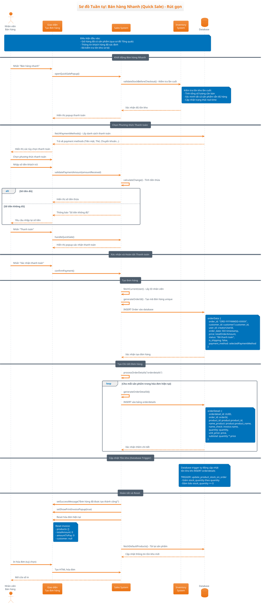

# Sơ đồ Tuần tự: Bán hàng Nhanh (Quick Sale)

## Mô tả
Sơ đồ này mô tả quy trình bán hàng nhanh (rút gọn), bắt đầu từ khi đã có sản phẩm và khách hàng, tập trung vào việc xử lý thanh toán và hoàn tất đơn hàng.

## Điều kiện tiên quyết
- Đã hoàn thành quy trình "Bán hàng Tổng quát" (Sơ đồ 0)
- Đã có sản phẩm trong giỏ hàng và đã kiểm tra tồn kho
- Thông tin khách hàng đã được xác định
- Nhân viên đã chọn "Bán hàng nhanh"

## Actors
- **Nhân viên bán hàng** (Sales Staff)
- **Hệ thống bán hàng** (Sales System)
- **Cơ sở dữ liệu** (Database)
- **Hệ thống tồn kho** (Inventory System)

## Sequence Diagram (PlantUML)

## Các bước chính trong quy trình:

### 1. Khởi tạo và Thêm sản phẩm
- Nhân viên truy cập trang tạo đơn hàng
- Hệ thống lấy danh sách sản phẩm mặc định
- Nhân viên tìm kiếm và thêm sản phẩm vào hóa đơn
- Hệ thống kiểm tra tồn kho và tính tổng tiền

### 2. Xử lý Thanh toán
- Nhân viên nhấn "Bán hàng nhanh"
- Hệ thống kiểm tra tồn kho toàn bộ
- Hiển thị popup chọn phương thức thanh toán
- Nhân viên nhập số tiền và xác nhận

### 3. Tạo Đơn hàng
- Tạo record trong bảng `orders`
- Tạo các record trong bảng `orderdetails`
- Database trigger tự động cập nhật tồn kho
- Reset giao diện và hiển thị thông báo thành công

## Đặc điểm của Quick Sale:
- `is_shipping: false` - Không có vận chuyển
- `status: "Đã thanh toán"` - Thanh toán ngay lập tức
- Sử dụng database trigger để cập nhật tồn kho tự động
- Chỉ xử lý hóa đơn hiện tại (activeInvoiceIndex)

## Files liên quan:
- `/app/dashboard/sales/create/page.tsx` (dòng 999-1426)
- Database: bảng `orders`, `orderdetails`, `products`
- Trigger: `update_product_stock_on_order`
