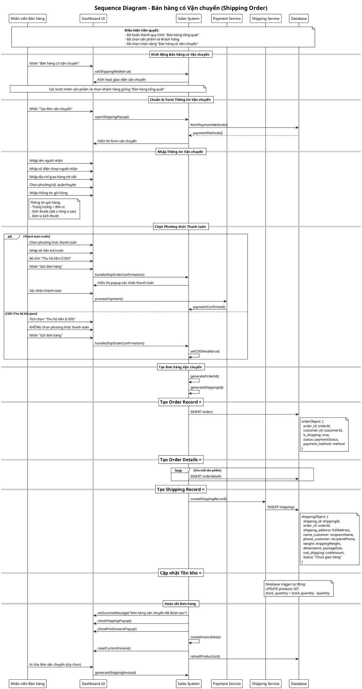

# Sơ đồ Tuần tự: Bán hàng có Vận chuyển (Shipping Order)

## Mô tả
Sơ đồ này mô tả quy trình bán hàng có vận chuyển (rút gọn), tập trung vào việc nhập thông tin vận chuyển và các điểm khác biệt so với bán hàng nhanh.

## Điều kiện tiên quyết
- Đã hoàn thành quy trình "Bán hàng tổng quát" (Sơ đồ 0)
- Đã có sản phẩm trong giỏ hàng và đã chọn khách hàng
- Nhân viên đã chọn "Bán hàng có Vận chuyển"

## Actors
- **Nhân viên bán hàng** (Sales Staff)
- **Giao diện Dashboard** (Dashboard UI) 
- **Hệ thống bán hàng** (Sales System)
- **Dịch vụ vận chuyển** (Shipping Service)
- **Cơ sở dữ liệu** (Database)

## Sequence Diagram (PlantUML)

## Điểm khác biệt chính với Quick Sale:

### 1. **Thông tin bổ sung**
- **Địa chỉ giao hàng**: Tên người nhận, SĐT, địa chỉ chi tiết
- **Thông tin gói hàng**: Trọng lượng, kích thước, đơn vị đo

### 2. **Tùy chọn thanh toán linh hoạt**
- **Thanh toán trước**: Chọn PTTT + nhập số tiền trả trước
- **COD**: Thu hộ tiền khi giao hàng

### 3. **Database records**
- **orders**: `is_shipping: true`
- **shippings**: Bảng riêng chứa thông tin vận chuyển
- **Trạng thái**: "Đã thanh toán" hoặc "Chưa thanh toán"

### 4. **Quy trình xử lý**
| Bước | Quick Sale | Shipping Order |
|------|------------|----------------|
| Thanh toán | Bắt buộc ngay | Trả trước hoặc COD |
| Thông tin khách | Cơ bản | + Địa chỉ giao hàng |
| Database | 2 bảng | 3 bảng (thêm shippings) |
| Hóa đơn | In ngay | In + thông tin vận chuyển |

## Files liên quan:
- `/app/dashboard/sales/create/page.tsx` (dòng 1530-1802)
- Database: `orders`, `orderdetails`, `shippings`
- Trigger: `update_product_stock_on_order`
