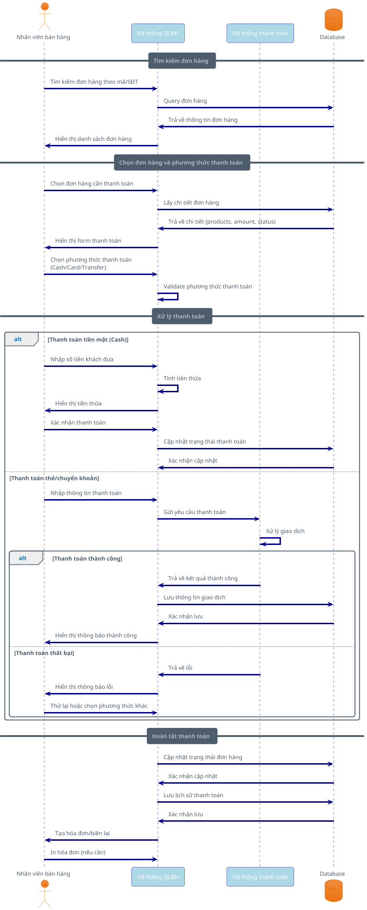

# Payment Processing Sequence Diagram

## Mô tả
Sơ đồ tuần tự mô tả quy trình xử lý thanh toán trong hệ thống QLBH, từ việc tìm kiếm đơn hàng đến xác nhận thanh toán thành công.

## Actors
- **Nhân viên bán hàng**: Thực hiện quá trình thanh toán
- **Hệ thống QLBH**: Xử lý logic nghiệp vụ
- **Hệ thống thanh toán**: Xử lý giao dịch tài chính
- **Database**: Lưu trữ thông tin thanh toán

## PlantUML Code

## Use Cases
1. **Thanh toán tiền mặt**: Xử lý thanh toán trực tiếp, tính tiền thừa
2. **Thanh toán thẻ**: Tích hợp với cổng thanh toán bên ngoài
3. **Thanh toán chuyển khoản**: Xác thực giao dịch ngân hàng
4. **Xử lý lỗi**: Retry mechanism khi thanh toán thất bại

## Business Rules
- Đơn hàng phải ở trạng thái "Pending" mới có thể thanh toán
- Số tiền thanh toán phải khớp với tổng giá trị đơn hàng
- Mỗi giao dịch phải được ghi log để audit
- Hỗ trợ thanh toán một phần (partial payment)
