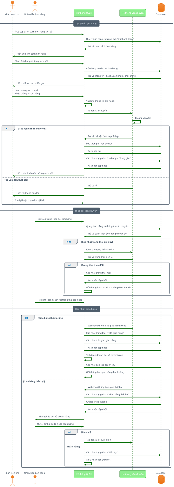

# Shipping Management Sequence Diagram

## Mô tả
Sơ đồ tuần tự mô tả quy trình quản lý vận chuyển trong hệ thống QLBH, từ tạo phiếu gửi hàng đến theo dõi và cập nhật trạng thái giao hàng.

## Actors
- **Nhân viên kho**: Chuẩn bị và gửi hàng
- **Nhân viên bán hàng**: Theo dõi đơn hàng
- **Hệ thống QLBH**: Xử lý logic nghiệp vụ
- **Hệ thống vận chuyển**: Đối tác giao hàng (GHN, GHTK, v.v.)
- **Database**: Lưu trữ thông tin vận chuyển

## PlantUML Code

## Use Cases
1. **Tạo phiếu gửi hàng**: Tích hợp với nhà cung cấp vận chuyển
2. **Theo dõi real-time**: Cập nhật trạng thái tự động qua webhook
3. **Xử lý giao hàng thất bại**: Workflow retry và hoàn hàng
4. **Báo cáo vận chuyển**: Tracking performance và chi phí

## Business Rules
- Chỉ đơn hàng đã thanh toán mới được tạo phiếu gửi
- Mỗi đơn hàng chỉ có một mã vận đơn active
- Tự động cập nhật trạng thái qua API/webhook
- Lưu lịch sử tất cả trạng thái để audit
