# Inventory Stock Management Sequence Diagram

## Mô tả
Sơ đồ tuần tự mô tả các quy trình quản lý tồn kho trong hệ thống QLBH, bao gồm nhập kho, xuất kho, kiểm kê và cảnh báo tồn kho thấp.

## Actors
- **Nhân viên kho**: Quản lý kho hàng
- **Nhân viên bán hàng**: Tạo đơn hàng ảnh hưởng tồn kho
- **Manager**: Phê duyệt và theo dõi báo cáo
- **Hệ thống QLBH**: Xử lý logic nghiệp vụ
- **Nhà cung cấp**: Cung cấp hàng hóa
- **Database**: Lưu trữ thông tin tồn kho

## PlantUML Code

```plantuml
@startuml Inventory Stock Management Sequence Diagram
!theme aws-orange
skinparam participant {
    BackgroundColor lightyellow
    BorderColor darkorange
}
skinparam sequence {
    ArrowColor darkorange
    LifeLineBorderColor darkorange
}

actor "Nhân viên kho" as WarehouseStaff
actor "Nhân viên bán hàng" as SalesStaff  
actor "Manager" as Manager
participant "Hệ thống QLBH" as System
actor "Nhà cung cấp" as Supplier
database "Database" as DB

== Nhập kho hàng hóa ==
WarehouseStaff -> System: Tạo phiếu nhập kho
System -> WarehouseStaff: Hiển thị form nhập kho

WarehouseStaff -> System: Nhập thông tin sản phẩm\n(Mã SP, số lượng, giá nhập, nhà cung cấp)
System -> System: Validate thông tin sản phẩm
System -> DB: Kiểm tra sản phẩm có tồn tại
DB -> System: Trả về thông tin sản phẩm

alt Sản phẩm đã tồn tại
    System -> DB: Cập nhật số lượng tồn kho
    System -> DB: Thêm bản ghi lịch sử nhập kho
else Sản phẩm mới
    System -> DB: Tạo sản phẩm mới
    System -> DB: Tạo bản ghi tồn kho ban đầu
end

DB -> System: Xác nhận cập nhật
System -> WarehouseStaff: Hiển thị thông báo nhập kho thành công
System -> System: Tự động cập nhật giá trung bình

== Xuất kho (bán hàng) ==
SalesStaff -> System: Tạo đơn hàng với sản phẩm
System -> DB: Kiểm tra tồn kho sản phẩm
DB -> System: Trả về số lượng tồn kho hiện tại

alt Đủ hàng trong kho
    System -> DB: Reserve số lượng cho đơn hàng
    DB -> System: Xác nhận reserve
    System -> SalesStaff: Cho phép tạo đơn hàng
    
    SalesStaff -> System: Xác nhận đơn hàng
    System -> DB: Trừ số lượng tồn kho thực tế
    System -> DB: Tạo bản ghi xuất kho
    DB -> System: Xác nhận xuất kho
    
    System -> System: Kiểm tra ngưỡng tồn kho tối thiểu
    alt Tồn kho dưới ngưỡng
        System -> WarehouseStaff: Gửi cảnh báo tồn kho thấp
        System -> Manager: Gửi báo cáo cần nhập hàng
    end
    
else Không đủ hàng
    System -> SalesStaff: Thông báo không đủ hàng
    SalesStaff -> System: Chọn sản phẩm thay thế hoặc đặt hàng trước
    
    alt Đặt hàng trước (Pre-order)
        System -> DB: Tạo đơn hàng với trạng thái "Chờ hàng"
        System -> WarehouseStaff: Thông báo cần nhập hàng
    end
end

== Kiểm kê tồn kho ==
WarehouseStaff -> System: Bắt đầu kiểm kê định kỳ
System -> DB: Lấy danh sách sản phẩm cần kiểm kê
DB -> System: Trả về danh sách với số lượng lý thuyết
System -> WarehouseStaff: Hiển thị danh sách kiểm kê

loop Kiểm kê từng sản phẩm
    WarehouseStaff -> System: Nhập số lượng thực tế đếm được
    System -> System: So sánh với số lượng lý thuyết
    
    alt Có chênh lệch
        System -> System: Tính toán chênh lệch (+/-)
        System -> WarehouseStaff: Hiển thị cảnh báo chênh lệch
        WarehouseStaff -> System: Xác nhận số lượng sau kiểm tra lại
    end
    
    System -> DB: Cập nhật số lượng tồn kho thực tế
    System -> DB: Ghi log chênh lệch kiểm kê
end

System -> DB: Hoàn thành phiếu kiểm kê
DB -> System: Xác nhận hoàn thành
System -> Manager: Gửi báo cáo kết quả kiểm kê

== Cảnh báo tồn kho thấp ==
loop Kiểm tra định kỳ (Daily)
    System -> DB: Query sản phẩm có tồn kho < ngưỡng tối thiểu
    DB -> System: Trả về danh sách sản phẩm cần nhập
    
    alt Có sản phẩm cần nhập
        System -> WarehouseStaff: Gửi email/notification cảnh báo
        System -> Manager: Gửi báo cáo tồn kho tuần
        
        Manager -> System: Xem chi tiết báo cáo
        System -> DB: Lấy lịch sử bán hàng và dự báo
        DB -> System: Trả về dữ liệu phân tích
        System -> Manager: Hiển thị đề xuất số lượng nhập
        
        Manager -> System: Phê duyệt đặt hàng nhà cung cấp
        System -> Supplier: Gửi đơn đặt hàng tự động
        Supplier -> System: Xác nhận đơn hàng và thời gian giao
    end
end

== Báo cáo tồn kho ==
Manager -> System: Truy cập báo cáo tồn kho
System -> DB: Query dữ liệu tồn kho theo kỳ
DB -> System: Trả về dữ liệu thống kê

System -> System: Tính toán các chỉ số:\n- Vòng quay kho\n- Giá trị tồn kho\n- Top sản phẩm bán chạy\n- Sản phẩm ế ẩm

System -> Manager: Hiển thị dashboard báo cáo
Manager -> System: Export báo cáo Excel/PDF
System -> Manager: Tạo file báo cáo

@enduml
```

## Use Cases
1. **Nhập kho**: Cập nhật tồn kho khi nhận hàng từ nhà cung cấp
2. **Xuất kho**: Trừ tồn kho khi bán hàng, kiểm tra availability
3. **Kiểm kê**: Đối chiếu thực tế vs lý thuyết, điều chỉnh chênh lệch
4. **Cảnh báo tự động**: Thông báo khi tồn kho dưới ngưỡng tối thiểu
5. **Đặt hàng tự động**: Tích hợp với nhà cung cấp khi cần nhập hàng
6. **Báo cáo phân tích**: Dashboard theo dõi hiệu quả quản lý kho

## Business Rules
- Không cho phép bán khi tồn kho không đủ (trừ pre-order)
- Mỗi giao dịch xuất/nhập kho phải có phiếu chứng từ
- Kiểm kê định kỳ ít nhất 1 tháng/lần
- Cảnh báo tồn kho thấp khi < 10% ngưỡng tối thiểu
- Tự động tính giá trung bình khi nhập hàng với giá khác nhau
